# velog-readme-stats

[](https://github.com/BcKmini/velog-readme-stats/actions/workflows/ci.yml)
[](LICENSE)

Velog 블로그 통계를 예쁘 SVG 카드로 만들어 GitHub 프로필 README, 고정 레포지토리, 어디든 바로 넣을 수 있게 해주는 도구입니다.

전체 조회수·좋아요·게시글 수 요약, 조회수 추이 그래프, 인기글 랭킹, 최근 게시글, 포스팅 활동 히트맵, 인라인 배지, 그리고 이 모든 걸 한 장으로 합친 대시보드 카드까지 — 카드 7종과 테마 12종을 조합해서 내 프로필에 딜 맞는 조합을 골라 쓸 수 있습니다.

Velog는 조회수와 좋아요 데이터를 작성자 본인에게만 공개하고 별도의 공개 통계 API를 제공하지 않습니다. 그래서 이 도구는 여러분 자신의 GitHub Actions에서, 여러분 자신의 Velog 인증 정보로 실행되도록 설계했습니다. 데이터와 인증 토큰이 여러분의 저장소 밖으로 나가는 일이 없습니다.

---

## 카드 갤러리

### 요약 카드

카드 값은 `summary`입니다. 전체 조회수·좋아요·게시글 수와 최근 N일 전 대비 증감을 한눈에 보여줍니다.

<p align="center">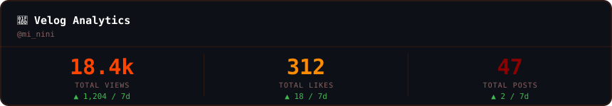</p>

### 조회수 추이 카드

카드 값은 `trend`입니다. 최근 N일간 전체 조회수 변화를 영역과 선 그래프로 보여줍니다.

<p align="center">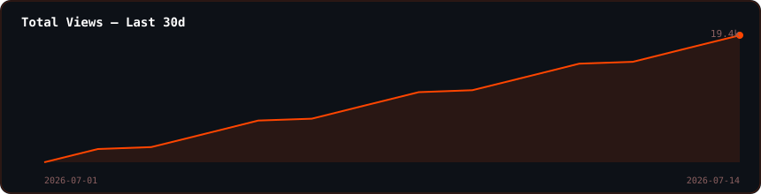</p>

### 인기글 랭킹 카드

카드 값은 `ranking`입니다. 조회수 기준 상위 N개 게시글을 막대그래프와 함께 보여줍니다.

<p align="center">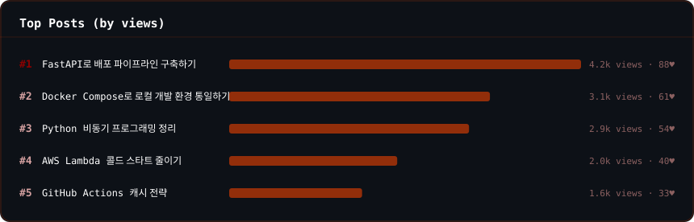</p>

### 최근 게시글 카드

카드 값은 `recent`입니다. 작성일 기준 가장 최근 게시글 N개를 보여줍니다.

<p align="center">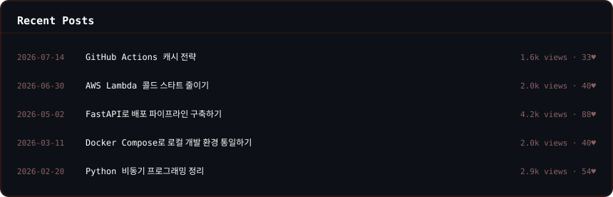</p>

### 포스팅 활동 히트맵 카드

카드 값은 `heatmap`입니다. 최근 N주간 포스팅 활동을 컸트리붸션 그래프 형태로 보여줍니다.

<p align="center">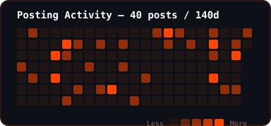</p>

### 인라인 배지 카드

카드 값은 `badge`입니다. 다른 배지들 옷에 나란히 붙이기 좋은 한 줄짜리 컴팩트 카드입니다.

<p align="center"></p>

### 조합형 대시보드 카드

카드 값은 `dashboard`입니다. 요약, 추이, 랭킹, 최근 게시글 섬션을 원하는 순서로 골라서 한 장의 카드에 합칠 수 있습니다. 카드를 하나만 관리하고 싶을 때, 또는 README 공간을 아끼고 싶을 때 유용합니다.

<p align="center">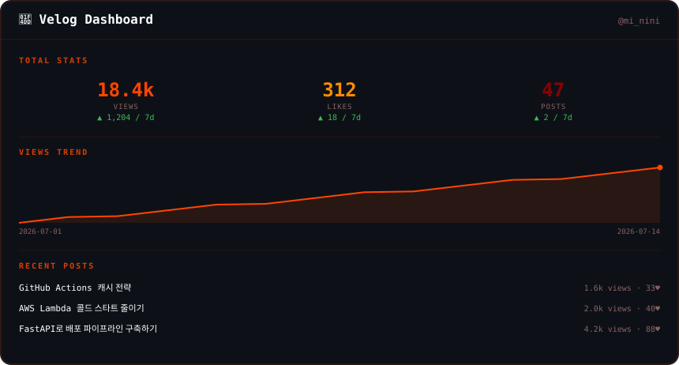</p>

```bash
# 예시: 요약과 랭킹만, 이 순서로
--sections summary,ranking

# 예시: 요약, 추이, 최근 게시글, 랭킹까지 전부
--sections summary,trend,recent,ranking
```

---

## 테마 갤러리

모든 테마는 다크 모드와 라이트 모드를 자동으로 지원합니다. 위 카드 예시들은 `ember` 테마로 그렸고, 아래는 12개 테마 전부를 같은 데이터로 비교한 모습입니다.

| 테마 | 미리보기 |
| --- | --- |
| `midnight` (기본값) | 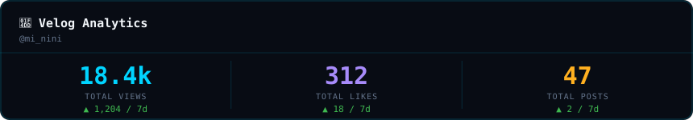 |
| `ember` |  |
| `forest` | 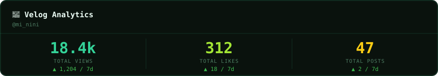 |
| `rose` | 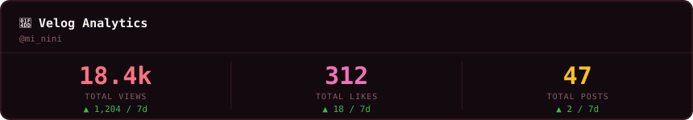 |
| `mono` | 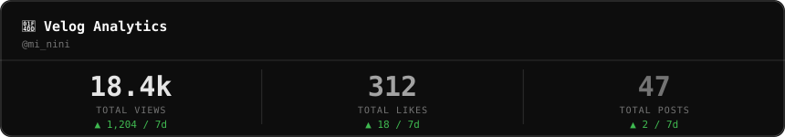 |
| `ocean` | 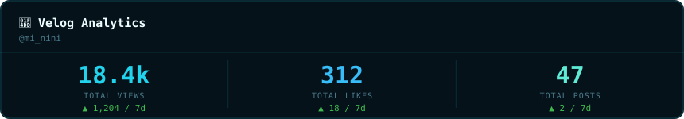 |
| `sunset` | 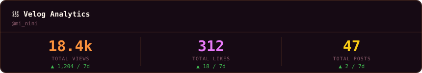 |
| `lavender` | 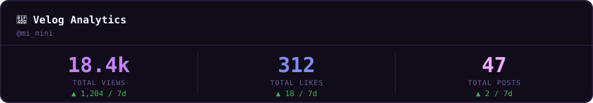 |
| `cyberpunk` | 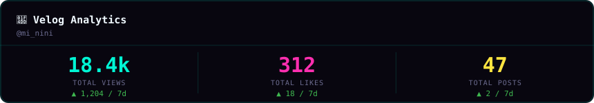 |
| `sakura` | 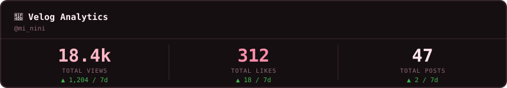 |
| `arctic` | 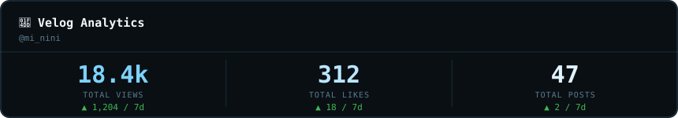 |
| `coffee` | 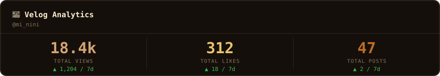 |

마음에 드는 테마가 없다면 색상 키(`void`, `nebula`, `synapse_cyan`, `dendrite_violet`, `axon_amber`, `text_bright`, `text_dim`, `text_faint`)를 직접 덮어써서 나만의 색상 구성을 만들 수도 있습니다. 코드에서 직접 호출하는 방법은 아래 "GitHub Actions 없이 사용하기" 항목을 참고해주세요.

---

## 기능 요약

- 카드 7종: `summary`, `trend`, `ranking`, `recent`, `heatmap`, `badge`, `dashboard`
- 테마 12종: `midnight`, `ember`, `forest`, `rose`, `mono`, `ocean`, `sunset`, `lavender`, `cyberpunk`, `sakura`, `arctic`, `coffee`
- 조합형 대시보드: `dashboard` 카드는 어떤 섬션을 어떤 순서로 넣을지 자유롭게 구성 가능
- 다크·라이트 모드 자동 대응, 별도 설정 불필요
- 데이터베이스도 외부 서비스도 없음 — 여러분 저장소에 함께 저장되는 작은 기록 파일로 추이와 증감을 계산
- 전부 여러분의 GitHub Actions 안에서만 실행 — Velog 인증 정보는 여러분 저장소의 시크릿에만 존재
- GitHub Action으로도, 독립 실행형 명령줄 도구로도 사용 가능

---

## 빠르게 시작하기

### 1. Velog 인증 토큰 발급받기

1. velog.io에 로그인합니다.
2. 개발자도구를 열고 애플리케이션 탭의 쿠키 목록에서 velog.io 항목을 확인합니다.
3. `access_token`, `refresh_token` 값을 각각 복사합니다.

### 2. 저장소 시크릿으로 등록

프로필 저장소(GitHub 아이디와 이름이 같은 그 저장소) 설정에서 시크릿 및 변수, 그다음 액션 메뉴로 들어가 아래 두 개를 등록합니다.

- `VELOG_ACCESS_TOKEN`
- `VELOG_REFRESH_TOKEN`

### 3. 워크플로우 추가

`examples/workflow.yml` 내용을 여러분 저장소의 `.github/workflows/velog-stats.yml`로 복사하고, `velog_username`을 본인 Velog 아이디로 바꿔주세요.

```yaml
name: Update Velog Stats

on:
  schedule:
    - cron: "0 */6 * * *"
  workflow_dispatch:

jobs:
  update:
    runs-on: ubuntu-latest
    permissions:
      contents: write
    steps:
      - uses: actions/checkout@v4

      - uses: BcKmini/velog-readme-stats@main
        with:
          velog_username: your-velog-id
          access_token: ${{ secrets.VELOG_ACCESS_TOKEN }}
          refresh_token: ${{ secrets.VELOG_REFRESH_TOKEN }}
          cards: summary,trend,recent,heatmap
          theme: ember

      - name: Commit changes
        run: |
          git config user.name "github-actions[bot]"
          git config user.email "github-actions[bot]@users.noreply.github.com"
          git add assets/velog
          if ! git diff --staged --quiet; then
            git commit -m "chore: update velog stats"
            git push
          fi
```

카드를 하나로 합치고 싶다면 `cards: dashboard`와 `sections: summary,trend,recent,ranking`을 대신 사용하세요.

### 4. README에 카드 넣기

```markdown


```

Actions 탭에서 "Update Velog Stats" 워크플로우를 한 번 수동으로 실행하면 첫 결과물이 생성됩니다.

---

## 설정값 레퍼런스

`velog_username`, `access_token`, `refresh_token`을 제외한 나머지는 전부 선택 항목입니다.

| 입력값 | 기본값 | 설명 |
| --- | --- | --- |
| `velog_username` | — | Velog 아이디입니다. `velog.io/@아이디`에서 `@` 뒷부분입니다. |
| `access_token` | — | Velog `access_token` 쿠키 값입니다. 시크릿으로 저장합니다. |
| `refresh_token` | — | Velog `refresh_token` 쿠키 값입니다. 시크릿으로 저장합니다. |
| `cards` | `summary,trend,recent` | `summary`, `trend`, `ranking`, `recent`, `heatmap`, `badge`, `dashboard` 중 쉬표로 구분해서 선택합니다. |
| `theme` | `midnight` | `midnight`, `ember`, `forest`, `rose`, `mono`, `ocean`, `sunset`, `lavender`, `cyberpunk`, `sakura`, `arctic`, `coffee` |
| `output_dir` | `assets/velog` | 생성된 SVG와 기록 파일을 저장할 디렉토리입니다. |
| `history_path` | `<output_dir>/velog-history.json` | 추이 기록 파일 경로를 직접 지정합니다. |
| `trend_days` | `30` | 추이 카드에 보여줄 기록 일수입니다. |
| `diff_days` | `7` | 요약 카드의 증감을 며칠 전 대비로 계산할지 정합니다. |
| `count` | `5` | 랭킹, 최근 게시글 카드에 보여줄 게시글 수입니다. `dashboard` 카드 안에서는 3개 정도가 보기 좋습니다. |
| `weeks` | `20` | 활동 히트맵 카드에 보여줄 주 수입니다. |
| `sections` | `summary,trend,recent` | `dashboard` 카드에 어떤 섬션을 어떤 순서로 넣을지 정합니다. `summary`, `trend`, `ranking`, `recent` 중 선택합니다. |

## 카드 종류

| 카드 값 | 내용 |
| --- | --- |
| `summary` | 전체 조회수, 좋아요, 게시글 수와 N일 증감 |
| `trend` | 최근 N일 전체 조회수 영역과 선 그래프 |
| `ranking` | 조회수 기준 인기글 상위 N개 |
| `recent` | 작성일 기준 최근 게시글 N개 |
| `heatmap` | 최근 N주 포스팅 활동을 컸트리붸션 그래프 형태로 표시 |
| `badge` | 다른 배지 옷에 나란히 붙이기 좋은 한 줄짜리 컴팩트 카드 |
| `dashboard` | `summary`, `trend`, `ranking`, `recent`를 원하는 조합과 순서로 합친 카드 |

---

## GitHub Actions 없이 사용하기

핵심 로직은 순수 파이썬 패키지라 로컬 환경이나 다른 CI 도구에서도 그대로 실행할 수 있습니다.

```bash
pip install -r requirements.txt
export VELOG_ACCESS_TOKEN=...
export VELOG_REFRESH_TOKEN=...
python -m velog_readme_stats.cli \
  --username your-velog-id \
  --cards summary,trend,recent,ranking,heatmap,badge,dashboard \
  --theme forest \
  --sections summary,trend,ranking
```

코드에서 직접 호출하면 색상을 완전히 자유롭게 지정할 수도 있습니다.

```python
from velog_readme_stats.cards import summary
from velog_readme_stats.themes import resolve_theme

my_theme = resolve_theme({
    "synapse_cyan": "#ff0055",
    "dendrite_violet": "#00e0ff",
    "axon_amber": "#ffe600",
})

svg = summary.generate(my_theme, velog_stats_dict)
```

---

## 기여하기

이슈와 풀 리퀴스트를 환영합니다. 새 테마, 새 카드, 버그 리포트 모두 좋습니다. 풀 리퀴스트를 올리기 전에 다음 명령으로 테스트를 실행해주세요.

```bash
pip install -r requirements-dev.txt
pytest
```

## 라이선스

이 프로젝트는 Apache License 2.0을 따릅니다. 자세한 내용은 `LICENSE` 파일을 참고해주세요.
